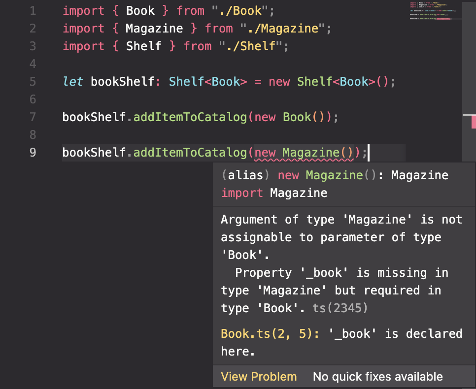

generics exist in languages like Java and C#

## What Are Generics?

- reusable coe that works with multiple types
- may be functions, interfaces, or classes
- code the accepts type paremeters for each instance or invocations

example:

```ts
import { Book } from "./Book";

export class BookShelf {
  _books: Book[] = [];

  addBookToCatalog(newBook: Book) {
    // add code here to catalog book
  }

  removeBookFromCatalog(oldBook: Book) {
    // add code here to remove book
  }
}
```

we have a book class we are importing and a Book class that adds and removes books from the catalog

if I also wanted to write something to store magazines, my code might look like this:

```ts
import { Magazine } from "./Magazine";

export class MagazineShelf {
  _magazines: Magazine[] = [];

  addMagazineToCatalog(newMagazine: Magazine) {
    // add code here to catalog magazine
  }

  removeMagazineFromCatalog(oldMagazine: Magazine) {
    // add code here to remove magazine
  }
}
```

the new MagazineShelf class contains nearly the same code

### generic class

with our two very similar classes, we can build a generic class that can handle books, magazines, and any other similar library type I might need to add or remove from the catalog

```ts
export class Shelf<T> {
  _items: T[] = [];

  addItemToCatalog(newItem: T) {
    // add code here to catalog item
  }

  removeItemFromCatalog(oldItem: T) {
    // add code here to remove item
  }
}
```

the secret ingredient here is the capital letter `T` inside angle brackets after the class name

it's a generic type parameter for the shelf class. it can be represented with any letter, but it's conventional to use `T`

adding a type parameter after the class name makes this a generic class.

when i create instances of the class, i'll need to specify what type should be ued in place of `T` **everywhere** `T` appears in the class definition

whatever type i specify for `T` when i create a class instance, will be the type stored in the array, as well as the type i passed to the two methods.

the type i specify **ONLY** applies to **THAT** instance of the shelf class

example using this new generic class:

```ts
import { Shelf } from "./Shelf";
import { Book } from "./Book";
import { Magazine } from "./Magazine";

let bookShelf: Shelf<Book> = new Shelf<Book>();
```

the methods on this new instances can now only accept Book objects as parameters.

if I try to add a new Book to the bookShelf, it works just fine, as it expects `Book`s

but if I try to pass it a new magazine instance, it gives me this error:



once i have specified which type to use for an instance, that's the type that must be used everywhere the `T` type parameter was used in the class definition.

this will allow me to reuse this code with many different types.

i no longer need to write new classes for a BookShelf and a MagazineShelf.ect.

## Using Generic Arrays
