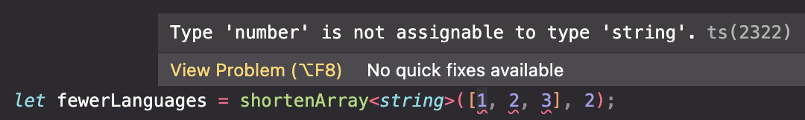

the checkout function accepts a single type parameter of type `T` inside the angle brackets just after the function name

the type you specify will be used for every instance of `T` inside the function

type inference works great with generics just like non-generics

if i didn't include the return type on the function, the typescript compiler would have inferred the return type based on the fact that im returning a value it already knows to have the type `T`

in order to use it, we write the code:

```ts
checkOut<Book>(someBook);
```


we are explicitly adding the type to the function call, but again, typescript could infer that based on the type of the parameter passed to the function since the compiler knows it must also have the type `T`

```ts
checkOut(someBook);
```


multiple type params

you are not limited to a single type parameter on a function

if we have more than one type parameter, you separate them with a comma in the angle brackets

the letter you assign to additional parameters is up to you

to call the function, we add a second type to the angle brackets when the function is invoked

```ts
checkOut<Book, Student>(someBook, someStudent);
```


again we are adding the types to the function call, but the compiler could still infer the types as well

```ts
checkOut(someBook, someStudent);
```


a single type is the most common in functions.

with each additional type, the level of abstraction goes up, and practicality goes down

## creating Generic Functions

passing in generic type parameters into functions can allow us to have our functions be able to process different kinds of data types

a generic shortenArray function:

```ts
function shortenArray<T>(data: Array<T>, amountToShorten: number) {
  return data.splice(amountToShorten, data.length);
}
```

can be used to shorten an array of any specific type

```ts
let stringArray: string[] = ["Visual Basic", "C++", "TypeScript", "JavaScript"];

let fewerLanguages = shortenArray(stringArray, 2);
```

returns an array of strings as expected

however, it can be used with other types and provide type-safety at a certain point in code

example:

our shortenArray function at this point in the code could be told to only accept strings as an argument, and would throw an error.

```ts
let fewerLanguages = shortenArray<string>([1, 2, 3], 2);
```



not passing in the type to the invoked function removes the error and the compiler assumes we are OK with the new return type being `number[]`

```ts
let fewerLanguages = shortenArray([1, 2, 3], 2);
```


